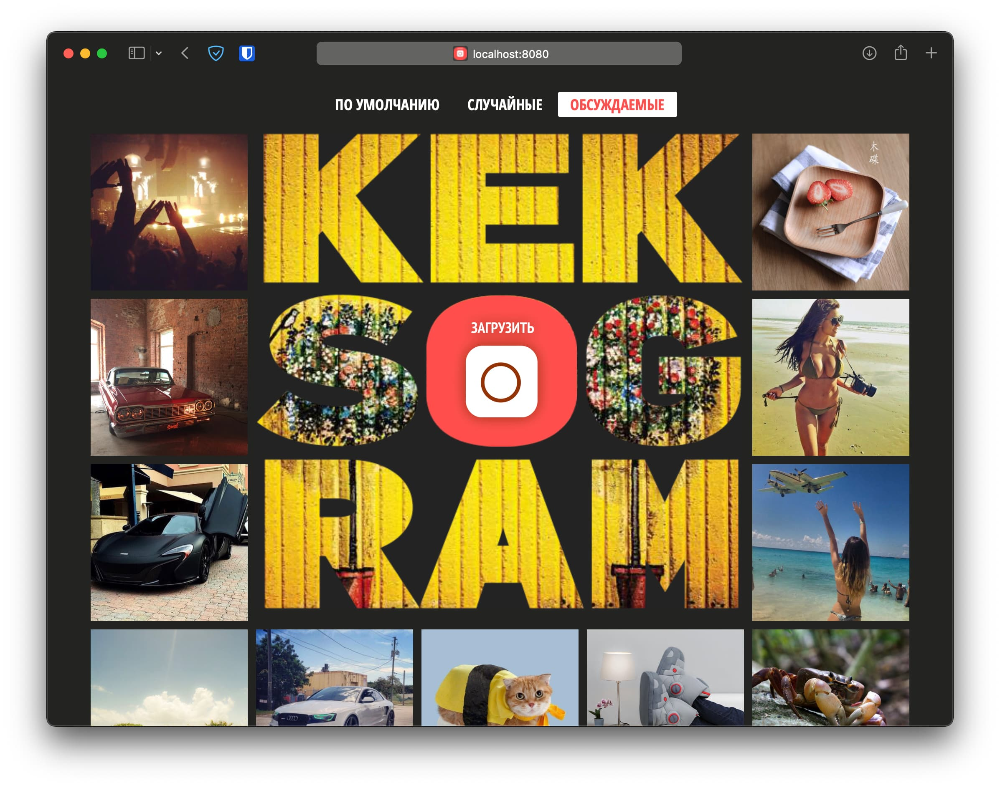

# Проект «Кекстаграм»

**Опубликованная версия доступна [тут](https://dreadwood.github.io/kekstagram/)**

## О проекте

Кекстаграм — сервис просмотра изображений. Пользователям предоставлена возможность загружать свои фотографии или просматривать фотографии, загруженные ранее другими пользователями.

## Разработка

### Основные команды:

* Установка - `npm i`
* Сборка проекта - `npm run build`
* Запуск локального сервера для разработки - `npm start`
* Запуск тестирования на соответствия код-гайдам - `npm run test`
* Обновить версию Github Pages (перед выполнением нужно собрать проект) - `gh-pages`

### Каталоги:

* Все разработка ведёться в директории `src/`
* Верстка, разметка, шрифты и изображения находятся в директории `public/`
* Итоговый код попадает в директорию `public/js/`
